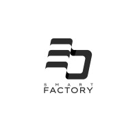

## 3D Smart Factory
- *Full Stack* | Jul'25 - Sep'23
- 
- Tags: Internship
- Badges:
  - Laravel [red]
  - HTML/CSS [blue]
  - JS [yellow]
- List Items:
  - Automate the integration process of interns within the company
  - Streamline the creation of PDF documents for interns
  - Monitor and track the progress of interns effectively

## Client
- *Full Stack* | Aug'25 - Oct'23
- 
- Tags: Freelance
- Badges:
  - Laravel [red]
  - Tailwind CSS [blue]
  - JS [yellow]
- List Items:
  - Developing a web application based on a predefined design
  - ensuring seamless implementation and functionality.
