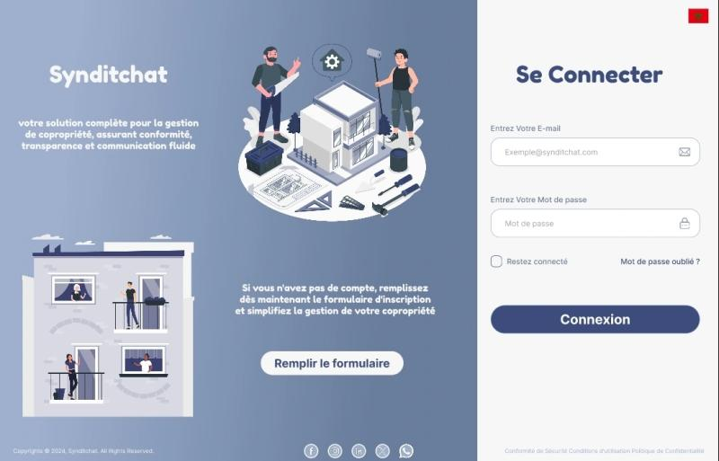

## Syndic Management
Developing a web application using Laravel, Tailwind CSS, and Blade components to efficiently manage and monitor both residents and residences, with more than five user roles for enhanced access control and functionality.
- 
- Tags: Proprietary software
- Badges:
  - Laravel [red]
  - Tailwind CSS [blue]
  - Ajax [yellow]
- Buttons:
  -  

## Random Genrated Map with AI that can controll the Player
Developing a game using the Unity engine that incorporates pathfinding algorithms such as Dijkstra's and A* to create sophisticated AI for player interactions. Utilizing graph theory to dynamically generate maps for each playthrough, ensuring a unique and engaging experience every time.
- 
- Tags: Open source / Hobie
- Badges:
  - Unity [black]
  - C# [green]
  - Algorithms [yellow]
  - Graph theory [blue]
- Buttons:
  - Source [https://github.com/khalilh2002/Unity-RPG-The-Quest-for-the-Shortest-Path]

## Internship Projct Automatization of internship process
This project automates the intern integration process within the company, streamlining PDF document creation and enabling effective monitoring and tracking of intern progress.
- 
- Tags: Open source / Hobie
- Badges:
  - Laravel [red]
- Buttons:
  - Source [https://example.com]

